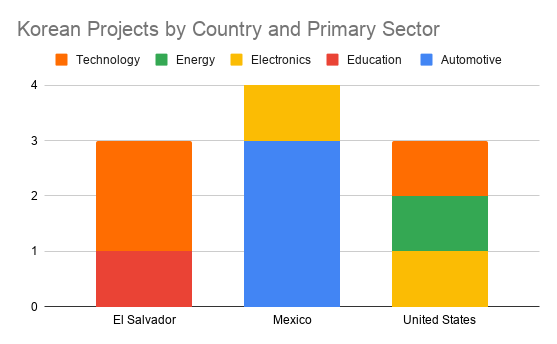
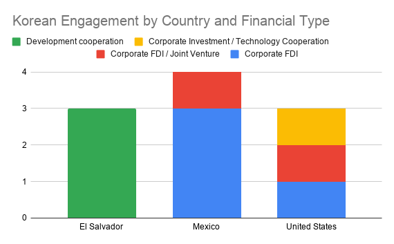
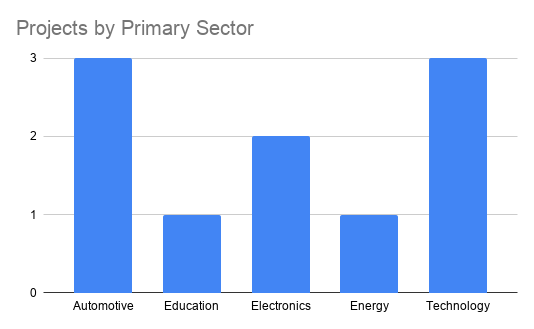

# korean-technology-investment-abroad
An exploratory analysis of selected South Korean technology, investment, and development-cooperation projects in El Salvador, Mexico, and the United States.

## Project Overview

This project examines selected South Korean technology, investment, and development-cooperation projects in El Salvador, Mexico, and the United States.

## Research Question

> How do South Korean companies and organizations transfer investment, technology, and expertise across different international markets?

## Background

This project began with a personal observation during a visit to El Salvador.

While visiting the country, I encountered Los Chorros, a major infrastructure project involving South Korean company Dongbu Corporation. That observation led me to investigate how South Korean companies and organizations operate outside Korea and how their investment, technology, and expertise are transferred across international markets.

The project subsequently expanded beyond infrastructure in El Salvador to include selected technology, manufacturing, automotive, electronics, energy, education, and development-cooperation projects in Mexico and the United States.

## Methodology

This project uses an exploratory comparative case-study approach.

The unit of analysis is an individual documented project or initiative involving a South Korean company or organization.

Projects were selected purposively based on their relevance to Korean investment, technology transfer, research and development, manufacturing, digital transformation, or development cooperation.

Data were collected through publicly available government, corporate, and institutional sources. Each project was coded according to country, Korean organization, sector, project type, year, investment amount where available, technology focus, local partners, financial structure, and source type.

The current dataset contains 10 selected projects across El Salvador, Mexico, and the United States.

Because the sample is purposively selected and relatively small, the findings should be interpreted as exploratory observations about the selected cases rather than as a comprehensive representation of all Korean activity in these countries.

## Dataset

The dataset contains 10 documented Korean projects:

- El Salvador: 3 projects
- Mexico: 4 projects
- United States: 3 projects

The working dataset was developed in Google Sheets and exported as an Excel workbook for the project repository.

[View the dataset](data/korean_projects_dataset.xlsx)

## Analysis

The project uses descriptive analysis to examine:

- Geographic distribution
- Primary and secondary sectors
- Financial and organizational structures
- Technology focus
- Korean organizations and local partners
- Investment amounts where reliable figures are available

## Visualizations

### Korean Projects by Country and Primary Sector

This visualization compares the primary sectors represented in the selected projects across the three countries.

### Korean Engagement by Country and Financial Type

This visualization compares the financial and organizational structures represented in the selected projects.

### Projects by Primary Sector

This visualization shows the distribution of selected projects across primary sectors.

## Findings

### Finding 1 — Different Forms of Korean Engagement

Within the selected cases, Korean engagement takes different forms across the three markets.

All three selected El Salvador cases are classified as development cooperation, while the four Mexican cases are classified as corporate investment. The three selected U.S. cases include corporate investment, a joint venture, and technology-oriented corporate activity.

The El Salvador cases are particularly connected to infrastructure, education, innovation, and technology-capacity development. The selected Mexican cases emphasize automotive, electronics, and industrial manufacturing, while the U.S. cases include semiconductor, battery, AI, and future-mobility activities.

These differences suggest that Korean international engagement can take multiple forms, ranging from development cooperation and infrastructure support to corporate manufacturing investment and advanced technology activities.

Because the dataset is a purposively selected sample of 10 projects, these observations should not be interpreted as representative of all Korean activity in each country.

### Finding 2 — Sector Distribution

*To be completed.*

### Finding 3 — Technology and Knowledge Transfer

*To be completed.*

## Limitations

*To be completed.*

## Future Research

*To be completed.*

## Sources

*To be completed.*
